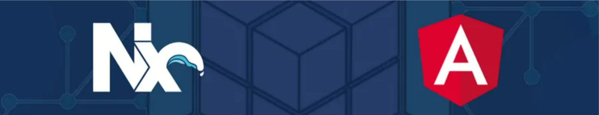

  

### 
<h2 align="left" style="font-family: 'Segoe UI', Tahoma, Geneva, Verdana, sans-serif; color: #2D3748;">
  Welcome to My GitHub Profile! 👋
</h2>
###

  Hi, I'm <strong>Ahmed Abd El Nabi</strong>! 🚀 
  I'm a passionate Full Stack Developer specializing in <strong>ASP.NET Core</strong> and <strong>Angular</strong>. With a strong drive to create dynamic, scalable, and efficient web applications, I love building end-to-end solutions that have a real-world impact. Let's collaborate and bring ideas to life!

### 
<h3 align="left" style="font-family: 'Arial', sans-serif; font-size: 20px; color: #2D3748;">
  Frontend Development
</h3>
###

  <strong>Frameworks & Libraries:</strong> Angular, Angular Material, PrimeNG 
  <strong>Languages:</strong> JavaScript, TypeScript, HTML, CSS 
  <strong>Styling Tools:</strong> Tailwind CSS, Bootstrap, SCSS 
  <strong>State Management:</strong> NgRx (Redux pattern), RxJS 
  <strong>Testing Tools:</strong> Unit Testing with Karma and Jasmine 
  <strong>Additional Angular Skills:</strong> Dynamic Components, Lazy Loading, Route Guards, Dependency Injection, Reactive Forms, Template-Driven Forms, Custom Pipes & Directives, Observables

###
<h3 align="left" style="font-family: 'Arial', sans-serif; font-size: 20px; color: #2D3748;">
  Backend Development
</h3>
###

  <strong>Frameworks:</strong> ASP.NET Core, Web API, MVC 
  <strong>Database Tools:</strong> LINQ, Entity Framework Core, Dapper 
  <strong>Databases:</strong> SQL Server, Oracle, MySQL, Redis 
  <strong>Authentication & Security:</strong> Identity Server, JWT, OAuth 
  <strong>Additional .NET Skills:</strong> Dependency Injection, Middleware, CQRS, Clean Architecture, SignalR for real-time communication, Unit Testing with xUnit, Logging with Serilog

###

  
  
  
  
  
  
  
  
  
  
  
  
  
  
  
  
  
  
  
  
  
  
  
  
  
  
  
  
  
  
  
  
  
  
  
  
  
  
  

### 

  <h3 style="font-family: 'Segoe UI', Tahoma, Geneva, Verdana, sans-serif; color: #2D3748; font-size: 24px;">Let's Build Something Amazing Together! 🚀</h3>

